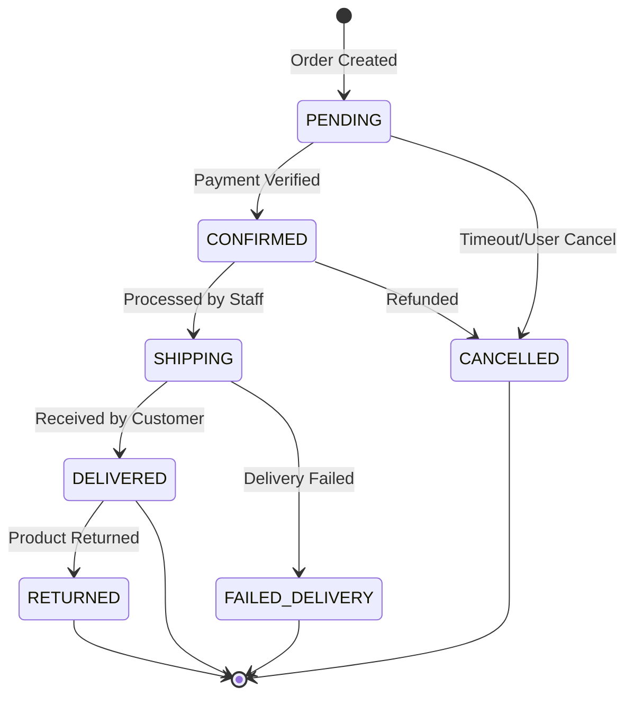

# Order Lifecycle & State Machine

## State Transitions

## Valid Transitions

- `PENDING` -> `CONFIRMED`: Payment verified or manual confirmation.
- `PENDING` -> `CANCELLED`: Timeout or user cancel.
- `CONFIRMED` -> `SHIPPING`: Order processed by staff.
- `CONFIRMED` -> `CANCELLED`: Admin refund or cancellation. **Refund is only required if `payment_status` is `PAID`.**
- `SHIPPING` -> `DELIVERED`: Courier confirmation.
- `SHIPPING` -> `FAILED_DELIVERY`: Courier could not reach customer or address issue.
- `DELIVERED` -> `RETURNED`: Damaged item, wrong product, or policy return.

## Business Rules

### 1. Stock Locking

- Stock is deducted when status moves from `[*] -> PENDING`.
- Stock is returned if status moves to `CANCELLED` from `PENDING` or `CONFIRMED`.

### 2. Transition Validation

- Status can only move forward in the defined sequence (except `CANCELLED`).
- `DELIVERED` is a terminal state.

### 3. Notification

- Send email notification to user on `CONFIRMED`, `SHIPPING`, and `DELIVERED`.
